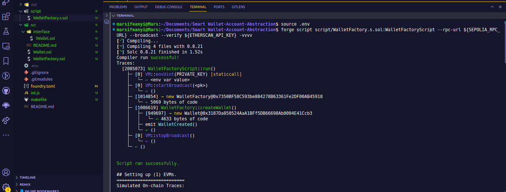
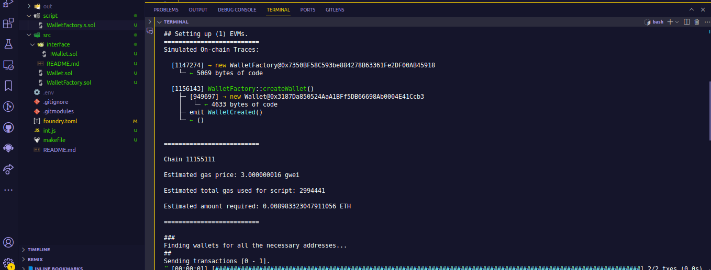
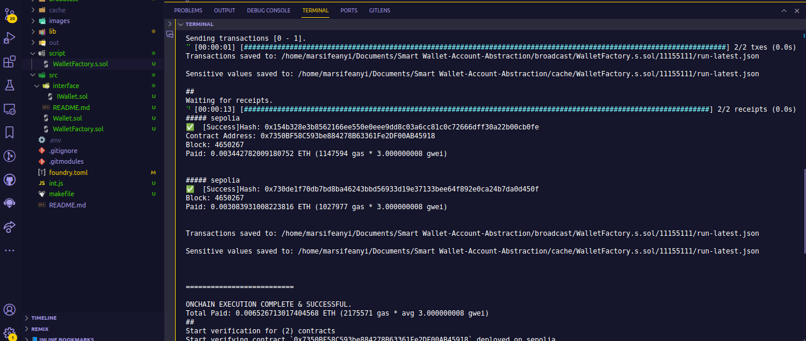
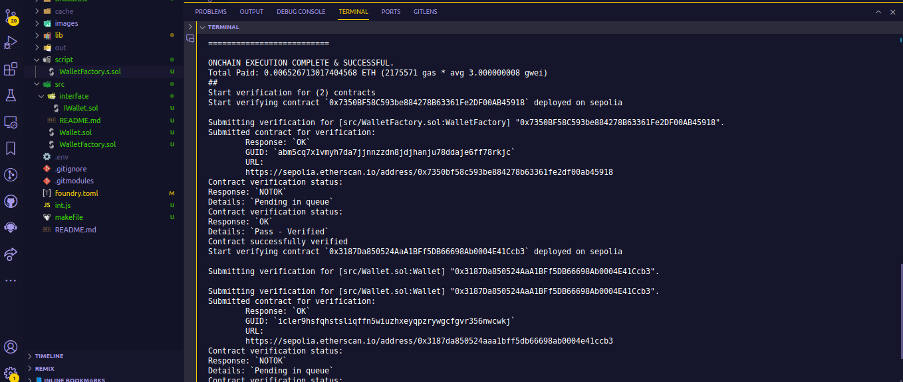
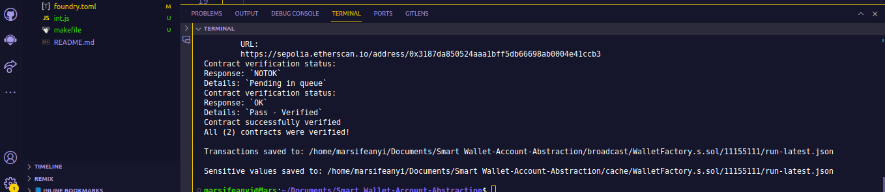
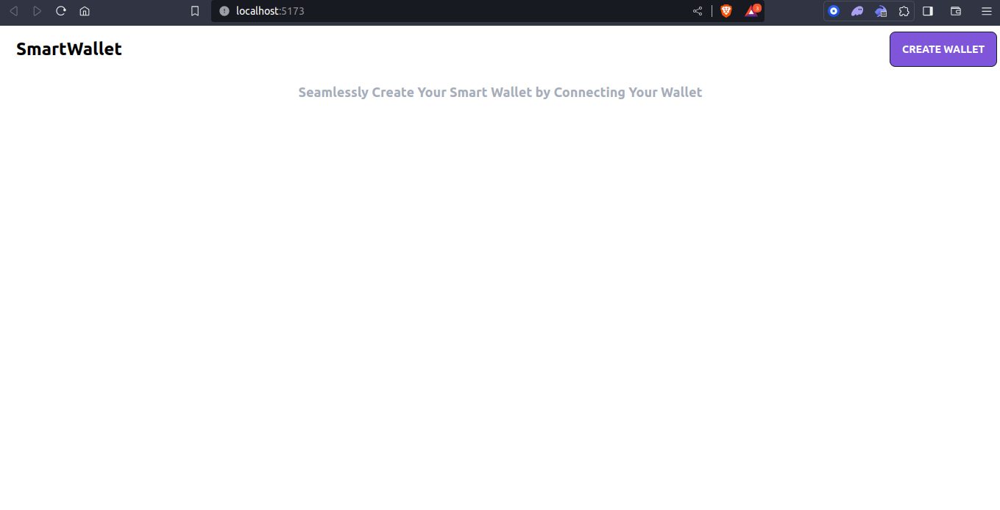
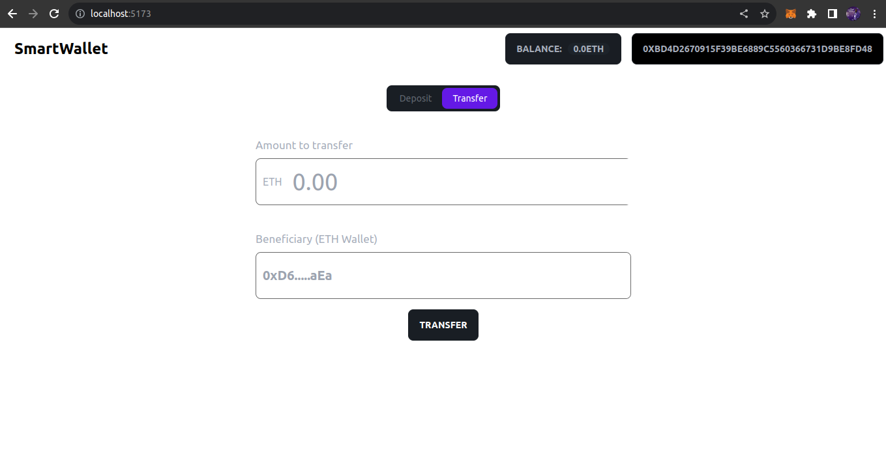
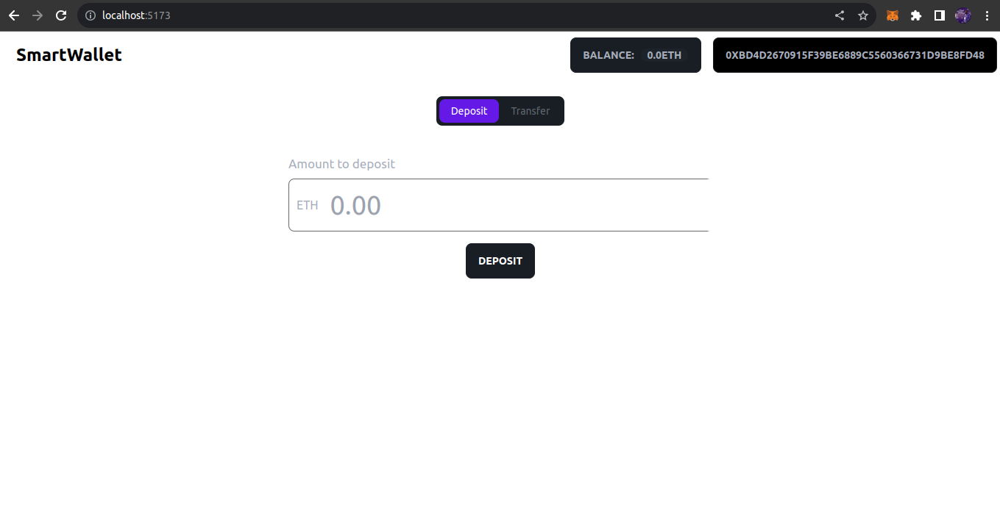

# Smart contract Wallet Account Abstraction (ERC4337)

This project uses `ERC4337` standard to create Smart wallet for a user and also has functionalities that allows users to deposit funds, receive Fund, and view the Balance

## Table of Contents

- [Smart contract Wallet Account Abstraction (ERC4337)](#smart-contract-wallet-account-abstraction-erc4337)
  - [Table of Contents](#table-of-contents)
  - [Overview-Description](#overview-description)
  - [Demo Video](#demo-video)
  - [Deploying and Verifying the Contracts on Sepolia testnet](#deploying-and-verifying-the-contracts-on-sepolia-testnet)
  - [Frontend UI](#frontend-ui)
  - [Authors](#authors)
  - [License](#license)

## Overview-Description

The project uses a `WalletFactory`, to create a smart contract `Wallet` for every user who wants to Create a Wallet.
The factory contract deploys instances of the child contract to create wallet for each user

The `Smart Wallet Dapp`, allows you to create smart wallets. It has a factory contract that spurns smart wallets for users. This smart wallet is tie to a user EOA, thus a user can deposit funds into it, send out funds to any wallet as well as view the user's balance.

## Demo Video

https://www.loom.com/share/304e34d323594fed869f7c47cda40365?sid=0dd8754d-db97-4f90-b00a-d3b3ee94802d

## Deploying and Verifying the Contracts on Sepolia testnet

- 

- 

- 

- 

- 

- 

## Frontend UI

- 

- 

- 

## Authors

Marcellus Ifeanyi
[@metacraftersio](https://twitter.com/Mars_Energy)

## License

This project is licensed under the MIT License - see the LICENSE.md file for details.
